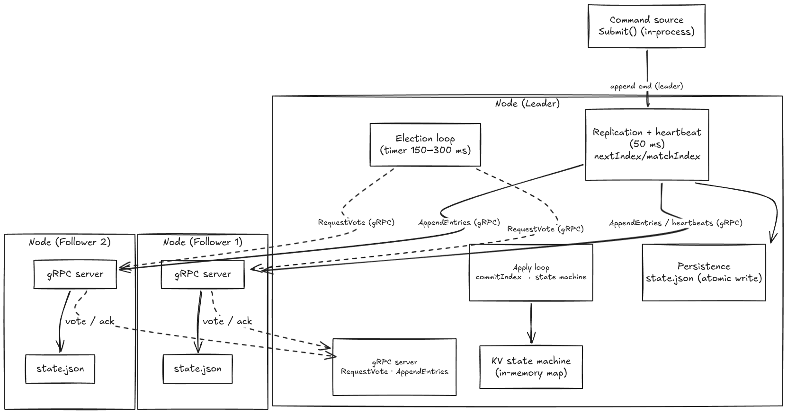

# otter

Implementation of the Raft consensus algorithm in Go.

## Architecture

- Multi-node implementation of the **Raft consensus protocol** in Go. Each node runs an identical process; peers communicate over **gRPC** with two RPCs: `RequestVote` and `AppendEntries`. Commands are applied to a replicated in-memory **key-value state machine** (`SET`/`DEL`).
- Per-node concurrency is structured as cooperating loops under a single `sync.Mutex` (locks released around blocking RPCs): an **election loop** (randomized 150–300 ms timeout), a leader **heartbeat loop** (50 ms), log **replication** with per-follower `nextIndex`/`matchIndex` + backtracking, and an **apply loop** that advances `lastApplied` toward `commitIndex`.
- **Safety**: votes require an up-to-date log; the commit index only advances when a majority match an entry of the **current term**; followers truncate conflicting entries.
- **Durability**: persistent state (`currentTerm`, `votedFor`, full log) is written to JSON via atomic temp-file + rename and restored on startup, so a restarted node rejoins without violating safety. Cluster membership is static (CLI `-peers`), any odd size.



## Build

```
make build
```

## Running a Cluster

Each node runs in its own terminal. Every node needs:
- `-id` - unique integer id
- `-addr` - address to listen on
- `-peers` - comma-separated `id=host:port` pairs for all other nodes
- `-data` - directory for persisted state (optional, defaults to `/tmp/raft-node-<id>`)

### 3-Node Cluster

```
# terminal 1
bin/node -id=0 -addr=:5000 -peers=1=localhost:5001,2=localhost:5002

# terminal 2
bin/node -id=1 -addr=:5001 -peers=0=localhost:5000,2=localhost:5002

# terminal 3
bin/node -id=2 -addr=:5002 -peers=0=localhost:5000,1=localhost:5001
```

### 5-Node Cluster

```
# terminal 1
bin/node -id=0 -addr=:5000 -peers=1=localhost:5001,2=localhost:5002,3=localhost:5003,4=localhost:5004

# terminal 2
bin/node -id=1 -addr=:5001 -peers=0=localhost:5000,2=localhost:5002,3=localhost:5003,4=localhost:5004

# terminal 3
bin/node -id=2 -addr=:5002 -peers=0=localhost:5000,1=localhost:5001,3=localhost:5003,4=localhost:5004

# terminal 4
bin/node -id=3 -addr=:5003 -peers=0=localhost:5000,1=localhost:5001,2=localhost:5002,4=localhost:5004

# terminal 5
bin/node -id=4 -addr=:5004 -peers=0=localhost:5000,1=localhost:5001,2=localhost:5002,3=localhost:5003
```

### Any Cluster Size

The pattern works for any odd number of nodes. For N nodes, give each node an id from 0 to N-1 and list all the others as peers.

### Things to Try

- **Watch leader election** - start all nodes and a leader is elected within a few hundred milliseconds
- **Kill the leader** - Ctrl+C a leader's terminal. A new leader is elected automatically
- **Kill a minority** - stop 1 node in a 3-node cluster or 2 nodes in a 5-node cluster. The cluster keeps working
- **Kill a majority** - stop 2 of 3 or 3 of 5 nodes. The remaining nodes keep holding elections but can never get enough votes
- **Restart a node** - start a previously killed node with the same flags. It restores its state from disk and rejoins the cluster
